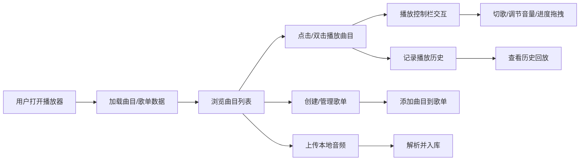

## 1. 产品概述

网页版本地音乐播放器，支持本地音频文件上传管理、播放控制、歌单创建与维护、播放历史记录。面向需要本地管理音乐库的用户，提供媲美主流播放器的交互体验。

## 2. 核心功能

### 2.1 功能模块

1. **主播放页面**：播放控制栏、曲目信息展示、播放状态动画、曲目列表
2. **歌单管理**：新建歌单、曲目增删、重命名、删除歌单
3. **上传管理**：本地音频文件上传、解析、加载入库
4. **播放历史**：播放记录存储、历史列表渲染、快速回放

### 2.2 页面详情

| 页面名称 | 模块名称 | 功能描述 |
|-----------|-------------|---------------------|
| 主播放页 | 播放控制栏 | 播放/暂停、上一首/下一首、音量调节、进度拖拽、循环模式、随机播放 |
| 主播放页 | 曲目信息区 | 封面、标题、艺术家、专辑信息实时更新、播放状态动画 |
| 主播放页 | 曲目列表 | 全曲目展示、双击播放、搜索过滤、排序 |
| 歌单面板 | 歌单管理 | 新建歌单、重命名、删除歌单、添加/移除曲目 |
| 上传面板 | 文件上传 | 拖拽上传、点击选择、支持 mp3/wav/flac/ogg 等格式、文件解析 |
| 历史面板 | 播放历史 | 按时间倒序展示播放记录、支持快速回放、清空历史 |

## 3. 核心流程

用户打开页面 → 浏览/搜索曲目列表 → 选择曲目播放 → 控制播放进度/音量/切歌 → 创建歌单并添加曲目 → 上传本地音频文件 → 查看播放历史。

## 4. 用户界面设计

### 4.1 设计风格
- **主色调**：深靛蓝 #1a1f36 渐变背景 + 霓虹青 #22d3ee 强调色
- **辅助色**：珊瑚粉 #f472b6 点缀、琥珀 #fbbf24 操作提示
- **按钮风格**：圆角胶囊按钮、悬浮发光效果、点击微缩放
- **字体**：Space Grotesk 显示字体 + DM Sans 正文字体
- **布局风格**：三栏式布局（左侧导航+中间内容区+右侧详情）、底部固定播放栏
- **图标风格**：Lucide React 线性图标，统一 20px 尺寸

### 4.2 页面设计概述

| 页面名称 | 模块名称 | UI 元素 |
|-----------|-------------|-------------|
| 主播放页 | 导航侧边栏 | 渐变色 Logo、菜单项图标+文字、当前选中高亮、上传入口 |
| 主播放页 | 曲目列表 | 卡片式行布局、序号/封面/标题/时长、悬浮显示操作按钮、斑马纹背景 |
| 主播放页 | 底部播放栏 | 毛玻璃背景、专辑封面旋转动画、进度条渐变填充、控制按钮组 |
| 主播放页 | 曲目详情 | 大尺寸封面碟片旋转动画、标题文字渐入效果、音频可视化频谱 |
| 歌单面板 | 歌单卡片 | 网格布局、封面图叠加标题、悬浮显示操作菜单 |
| 上传面板 | 上传区域 | 虚线边框、拖拽高亮、文件列表进度条 |
| 历史面板 | 历史列表 | 时间分组、最近播放顶部、快速重播按钮 |

### 4.3 响应式
桌面端优先，平板端自适应宽度，移动端折叠侧边栏为抽屉，底部播放栏压缩高度。
