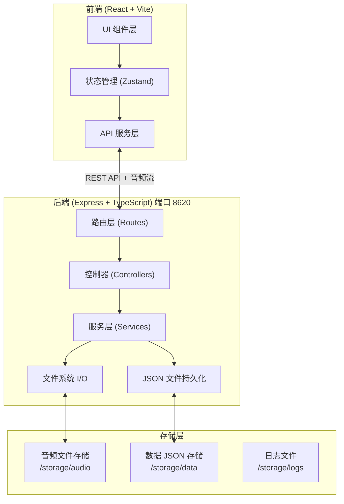
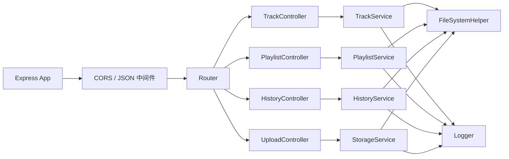
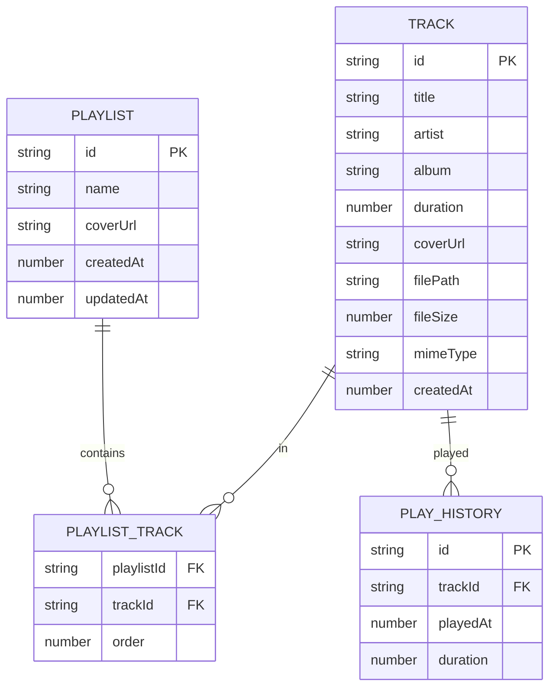

## 1. 架构设计



## 2. 技术描述

- **前端**：React@18 + TypeScript + TailwindCSS@3 + Zustand + React Router + Lucide React
- **初始化工具**：vite-init (react-express-ts 模板)
- **后端**：Express@4 + TypeScript + Multer(文件上传) + music-metadata(音频解析)
- **数据库**：本地 JSON 文件持久化（tracks.json / playlists.json / history.json）
- **音频流**：Express 流式读取 + Range 请求支持
- **日志系统**：Winston 文件日志 + 控制台输出

## 3. 路由定义

| 前端路由 | 用途 |
|-------|---------|
| / | 首页 - 曲目库列表 |
| /playlist/:id | 歌单详情页 |
| /playlists | 歌单管理面板 |
| /upload | 音频上传面板 |
| /history | 播放历史面板 |

## 4. API 定义

```typescript
// 曲目相关
interface Track {
  id: string;
  title: string;
  artist: string;
  album: string;
  duration: number;
  coverUrl?: string;
  filePath: string;
  fileSize: number;
  mimeType: string;
  createdAt: number;
}

// 歌单相关
interface Playlist {
  id: string;
  name: string;
  coverUrl?: string;
  trackIds: string[];
  createdAt: number;
  updatedAt: number;
}

// 播放历史
interface PlayHistoryItem {
  id: string;
  trackId: string;
  playedAt: number;
  duration: number;
}
```

| 方法 | 路径 | 用途 | 请求/响应 |
|-----|------|-----|-----------|
| GET | /api/tracks | 获取所有曲目 | → Track[] |
| GET | /api/tracks/:id | 获取单曲目 | → Track |
| GET | /api/tracks/:id/stream | 音频流式播放 | → 音频流 (支持 Range) |
| POST | /api/tracks/upload | 上传音频文件 | multipart/form-data → Track |
| DELETE | /api/tracks/:id | 删除曲目 | → {success: true} |
| GET | /api/playlists | 获取所有歌单 | → Playlist[] |
| POST | /api/playlists | 新建歌单 | {name} → Playlist |
| PUT | /api/playlists/:id | 重命名歌单 | {name} → Playlist |
| DELETE | /api/playlists/:id | 删除歌单 | → {success: true} |
| POST | /api/playlists/:id/tracks | 添加曲目到歌单 | {trackId} → Playlist |
| DELETE | /api/playlists/:id/tracks/:trackId | 从歌单移除曲目 | → Playlist |
| GET | /api/history | 获取播放历史 | → PlayHistoryItem[] |
| POST | /api/history | 添加播放记录 | {trackId, duration} → PlayHistoryItem |
| DELETE | /api/history | 清空播放历史 | → {success: true} |

## 5. 服务器架构



## 6. 数据模型

### 6.1 数据模型定义



### 6.2 JSON 文件结构

**/storage/data/tracks.json**
```json
[
  {
    "id": "uuid-string",
    "title": "歌曲名",
    "artist": "艺术家",
    "album": "专辑",
    "duration": 245,
    "coverUrl": "/storage/audio/uuid-cover.jpg",
    "filePath": "/storage/audio/uuid.mp3",
    "fileSize": 5242880,
    "mimeType": "audio/mpeg",
    "createdAt": 1710000000000
  }
]
```

**/storage/data/playlists.json**
```json
[
  {
    "id": "uuid-string",
    "name": "我的歌单",
    "coverUrl": null,
    "trackIds": ["track-uuid-1", "track-uuid-2"],
    "createdAt": 1710000000000,
    "updatedAt": 1710000000000
  }
]
```

**/storage/data/history.json**
```json
[
  {
    "id": "uuid-string",
    "trackId": "track-uuid",
    "playedAt": 1710000000000,
    "duration": 180
  }
]
```
